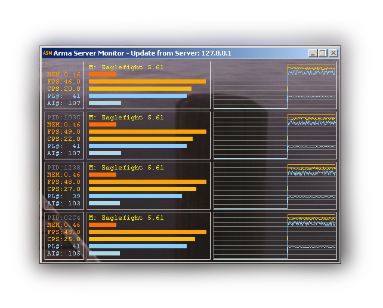

#Arma Server Monitor#

**Arma Server Monitor** is a spin-off of my "arma engine performance research".

Propertys:

	- monitors up to 4 instances
	- introduces a performance value CPS (nothing similar in the arma diag_## serie)
	- very simple and solid
	- nearly no influence to performance
	

Currently able to monitor the following values:

	- FPS (on server this means simulation frames per second)
	- CPS (Condition-evaluation Per Second)
	- PL# (Number of alive player units)
	- AI# (Number of alive AI units)
	- PID (process ID of the server process)
	- Name of the currently played mission

**Arma Server Monitor** consists of 3 components:

	ASM.fsm 				- Collects and reports some internal performance states from arma server (or HC)
	ASMdll.dll 				- Interfaces to ArmaServerMonitor.exe via MMF (Memory Mapped File)
	ArmaServerMonitor.exe 	- The Monitor itself reads from MMF and displays the values

An very interesting value is **CPS**.    
**CPS** is expressed by **condition** **evalations** per **second** and measured from an reference condition in `ASM.fsm`.   
You can realize the **CPS** value as something like the current "response time" of AI in the running mission.    
Especially COOP missions running with low **CPS** are really no pleasure. AI seems to be "stupid".   

Two examples to illustrate this value:   
Lets say we have a CPS value of 10.0, what means everything runs well.    
AI has a average response delay of ca. 100ms here (1000ms/10.0).      
In a second scenario we have a CPS value of 0.3, what means AI response time is larger the 3 seconds !!!   
(If the second scenario occurs together with normal FPS values, i recommend to have a talk with the mission developer,    
because this is very likely caused by excessively use of execVM, spawn etc.)    

**How to use:**

Copy `ASMdll.dll` to your arma directory (where arma3server.exe resists)   
Copy `ASM.FSM` to your extracted mission folder and add a start line to `init.sqf` (see example)
Pack your mission to a `.pbo` and copy it in your `MPMission` folder.

Run `ArmaServerMonitor.exe` to monitor all server (HC) instance with prepared missions.

*ENJOY :)*